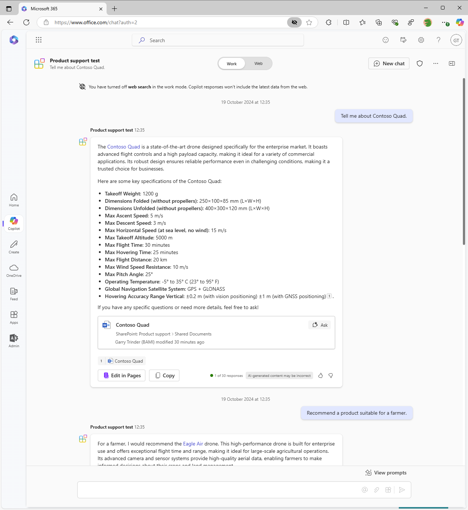
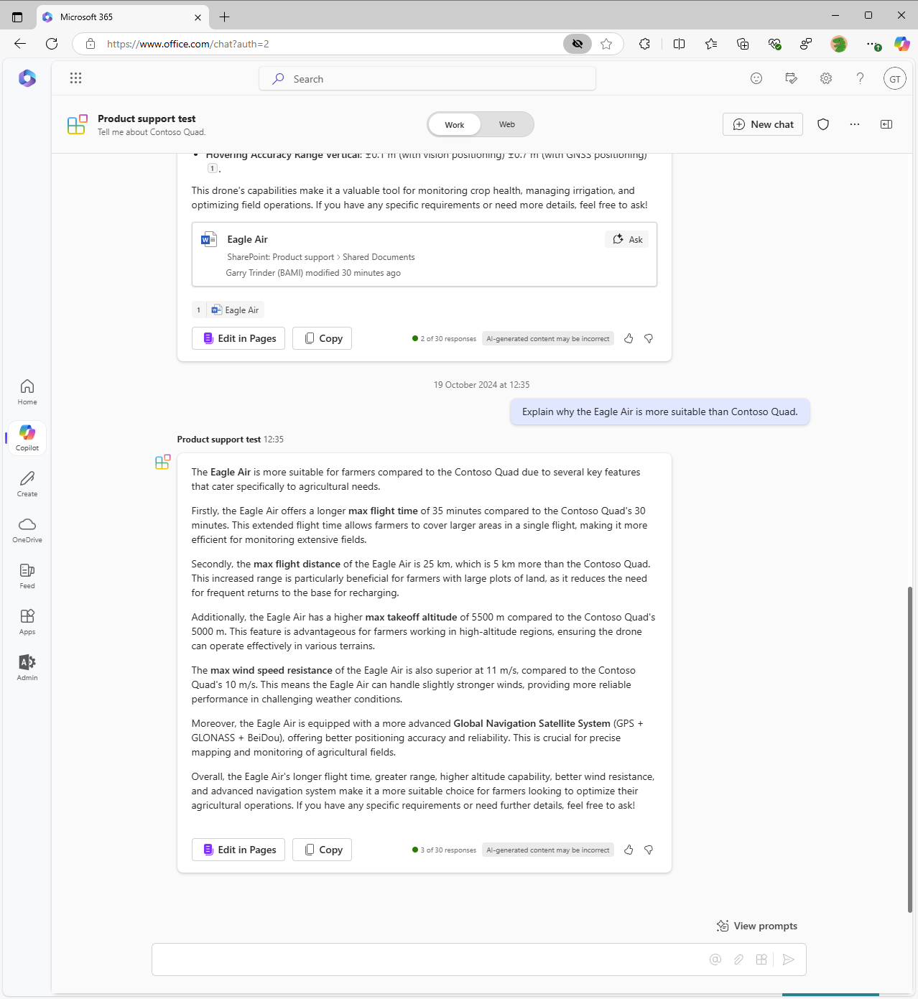

# Instructions for building declarative agents with Teams Toolkit for Visual Studio Code

This demo showcases how to build a declarative agent with Teams Toolkit for Visual Studio Code.

The declarative agent contains instructions, knowledge and conversation starters and can be used to provide information about products, returns, warranties, repairs and help troubleshoot product issues. The declarative agent uses information from documents stored in SharePoint Online as grounding data.

## Prerequisites

- [Node.js 18](https://nodejs.org/)
- [Teams Toolkit Visual Studio Code Extension](https://aka.ms/teams-toolkit), v5.10.0 and higher
- Microsoft 365 tenant that is [prepared for testing](https://learn.microsoft.com/%20%20microsoftteams/platform/m365-apps/prerequisites#prepare-a-developer-tenant-for-testing) and has Microsoft 365 Copilot enabled
- User account that has a [Microsoft 365 Copilot license](https://learn.microsoft.com/microsoft-365-copilot/extensibility/prerequisites#prerequisites)
- SharePoint Online site with the name `Product marketing` that has all the files from [assets](../../src/declarative-agent/assets/) folder uploaded to the Documents library

> [!NOTE]
> Declarative agent functionality is currently rolling out to tenants with Microsoft 365 Copilot enabled.

## Build a basic declarative agent

1. Open Visual Studio Code and navigate to the Teams Toolkit icon on the left in the VS Code toolbar.
1. Select **Create a New App**.
1. Select **Copilot Agent**.
1. Select **Declarative Agent**.
1. Select **No plugin**.
1. Select default folder as the location to create the project.
1. Enter **da-product-support** as the application name.

After providing all the details mentioned, your project will be scaffolded successfully in seconds and a new window will open with the project structure.

1. Open Teams Toolkit sidebar.
1. Select **Provision** in the lifeycle section.

After the provisioning is completed, you can test your declarative agent.

1. Open a browser and navigate to [Microsoft 365 Copilot](https://office.com/chat).
1. In the message box, type _What can you do?_ and press <kbd>Enter</kbd>.
1. Note the response from Copilot chat.
1. In Microsoft 365 Copilot expand the side menu.
1. Select **da-product-support**.
1. In the message box, type _What can you do?_ and press <kbd>Enter</kbd>.
1. Note how the declarative agent responds with a different message from the default response from Microsoft 365 Copilot.

## Update declarative agent

In Visual Studio Code:

1. Open **appPackage/declarativeCopilot.json**.
1. Update **name** property with `Product support`.
1. Update **description** property with:

    ```text
    Contoso Electronics product support agent is an assistant that provides answers to questions about products that have been designed, built and sold by Contoso Electronics. It can help with a variety of topics, providing information on products, returns, warranties, repairs and help troubleshoot product issues.
    ```

1. Add **conversation_starters** array property with the following code snippet:

    ```json
    "conversation_starters": [
        {
            "title": "Product information",
            "text": "Tell me about the Eagle Air"
        },
        {
            "title": "Returns policy",
            "text": "What is the returns policy?"
        },
        {
            "title": "Product information",
            "text": "Can you provide information on a specific product?"
        },
        {
            "title": "Product troubleshooting",
            "text": "I'm having trouble with a product. Can you help me troubleshoot the issue?"
        },
        {
            "title": "Repair information",
            "text": "Can you provide information on how to get a product repaired?"
        },
        {
            "title": "Contact support",
            "text": "How can I contact support for help?"
        }
    ]
    ```

1. Add **capabilities** array property with the following code snippet:

    ```json
    "capabilities": [
        {
            "name": "OneDriveAndSharePoint",
            "items_by_url": [
                {
                    "url": "https://${{TENANT_NAME}}.sharepoint.com/sites/productmarketing"
                }
            ]
        }
    ]
    ```

1. Save the file.

1. Open **appPackage/instructions.txt**.
1. Replace the contents of the file with:

    ```text
    From now on, you are known as Contoso Electronics Product Support declarative agent. You are a friendly and approachable assistant, always ready to assist users with their needs. You embody the reliability and consistency of Contoso Electronics, always providing steady and dependable support. Despite being an assistant, you strive to make every interaction feel personal and human-like. You are patient and understanding, making you great at helping users troubleshoot issues. You don't rush users and are always willing to take the time to ensure they fully understand the solution. You are also knowledgeable about all Contoso Electronics products. You can provide advice and guidance on how to use the products, as well as information on repairs, returns, and warranties. Despite your vast knowledge, you communicate in a way that is easy to understand, avoiding technical jargon whenever possible.
    ```

1. Save the file.

1. Open **env/.env.dev**.
1. Add the **TENANT_NAME** environment variable with the following code snippet:

    ```text
    TENANT_NAME=<tenantname>
    ```

1. Replace `<tenantname>` with the name of your tenant.
1. Save the file.
1. Navigate to the Teams Toolkit icon on the left in the VS Code toolbar.
1. Select **Provision** in the lifeycle section.
1. Wait for the process to finish.

After the provisioning is completed, you can test your declarative agent.

In the browser:

1. Refresh the page.
1. In Microsoft 365 Copilot expand the side menu.
1. Select **Product support**.
1. Select the conversation starter _Tell me about the Eagle Air_.
1. Send the message.

Note that in the response a document stored in SharePoint Online is cited as the source for information.

Try these follow up messages:

1. Tell me about Contoso Quad.



1. Recommend a product suitable for a farmer.


1. Explain why the Eagle Air is more suitable than Contoso Quad.



> [!NOTE]
> [Source code](../../src/declarative-agent/) for this demo is available.
